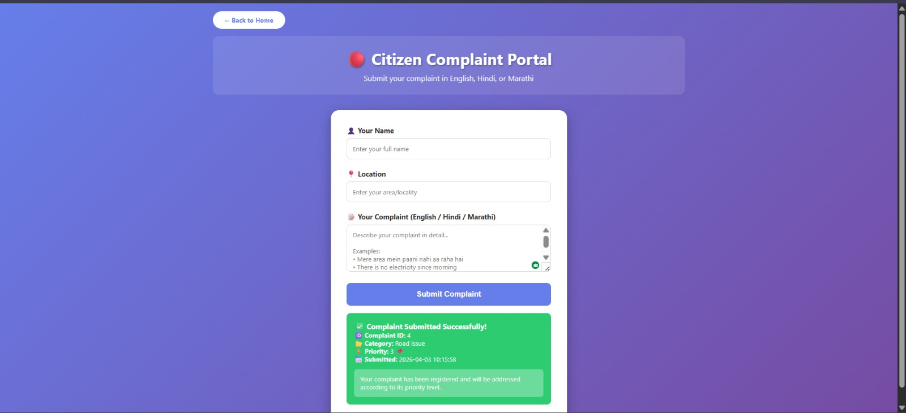
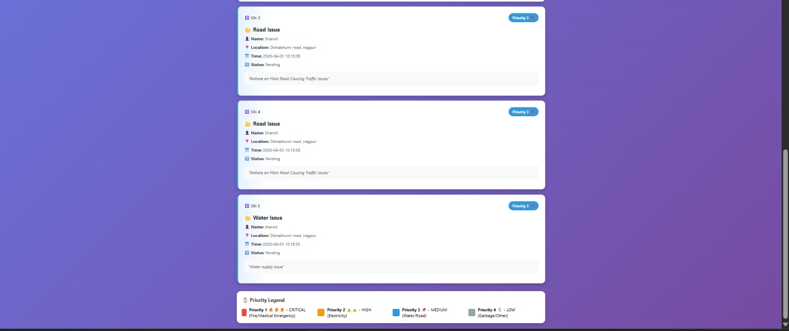

# 🧠 Smart Complaint System

### AI-Assisted Multilingual Citizen Complaint Portal

---

## 📌 Overview

The **Smart Complaint System** is an intelligent web-based platform designed to streamline the process of submitting, categorizing, and managing civic complaints.

Traditional complaint systems are often manual, slow, and lack prioritization. This system enhances efficiency by integrating **AI-driven classification and priority assignment**, ensuring faster and more structured issue resolution.

---

## 🚀 Key Features

* 🧾 **Citizen Complaint Portal**

  * Submit complaints with name, location, and description
  * Supports **English, Hindi, and Marathi**

* 🤖 **AI-Based Processing**

  * Automatic **complaint categorization**
  * Intelligent **priority assignment (Critical → Low)**

* 📊 **Complaint Dashboard**

  * View all submitted complaints
  * Displays ID, category, priority, timestamp, and status

* 🎯 **Priority Classification System**

  * 🔴 Priority 1 – Critical (Emergency)
  * 🟠 Priority 2 – High (Electricity Issues)
  * 🔵 Priority 3 – Medium (Road/Water Issues)
  * ⚪ Priority 4 – Low (General Issues)

* 💻 **User-Friendly Interface**

  * Clean, responsive UI
  * Smooth submission and instant feedback

---

## 🛠️ Tech Stack

| Layer            | Technology Used                |
| ---------------- | ------------------------------ |
| Backend          | Python (Flask)                 |
| Frontend         | HTML, CSS                      |
| Data Handling    | CSV (Pandas)                   |
| AI Logic         | Rule-based / ML-ready pipeline |
| Deployment Ready | GitHub                         |

---

## 📂 Project Structure

```
smart-complaint-system/
│── app.py                  # Main Flask application
│── generate_dataset.py     # Dataset generation script
│── requirements.txt        # Dependencies
│── README.md               # Documentation
│── dataset_10k.csv         # Sample dataset (optional)
│── new_complaints.csv      # Runtime data storage
│
├── templates/              # HTML templates
├── static/                 # CSS and assets
├── screenshots/            # Project screenshots
│     ├── portal.png
│     └── dashboard.png
```

---

## 📸 Screenshots

### 🧾 Citizen Complaint Portal



### 📊 Complaint Dashboard



---

## ⚙️ Installation & Setup

### 1️⃣ Clone the Repository

```bash
git clone https://github.com/your-username/smart-complaint-system.git
cd smart-complaint-system
```

### 2️⃣ Install Dependencies

```bash
pip install -r requirements.txt
```

### 3️⃣ Run the Application

```bash
python app.py
```

### 4️⃣ Open in Browser

```
http://127.0.0.1:5000/
```

---

## 🧪 Example Use Cases

* 🛣️ Road damage or pothole reporting
* 💡 Electricity outage complaints
* 🚰 Water supply issues
* 🔥 Emergency/fire-related complaints

---

## 📈 Future Enhancements

* Integration with **LLM APIs (GPT / FLAN-T5)** for advanced NLP
* Image-based complaint analysis (Computer Vision)
* Geo-tagging and map-based visualization
* Admin panel with analytics dashboard
* Real-time notifications and tracking

---

## 🎯 Problem Solved

* Eliminates manual complaint handling
* Enables structured and prioritized issue resolution
* Supports multilingual accessibility
* Improves transparency in civic management

---


---

## 👨‍💻 Author

**Sharwil Bhende**
B.Tech CSE 
Symbiosis Institute of Technology, Nagpur

---

## ⭐ Project Highlights (For Recruiters)

* Real-world **Smart City / Civic Tech application**
* Combines **AI + Web Development + Data Handling**
* Demonstrates **end-to-end system design**
* Clean UI + working backend + dataset pipeline

---

💡 *This project showcases how AI can be leveraged to improve public service systems and urban governance.*
